# Documentación Arquitectónica - Modelo C4

> **Proyecto:** FSA - Final Software Architecture  
> **Versión:** 1.0.0  
> **Fecha:** Noviembre 2025  
> **Arquitectura:** Microservicios orientada a eventos

---

## Tabla de Contenidos

1. [Introducción](#introducción)
2. [Modelo C4](#modelo-c4)
   - [Nivel 1: Contexto del Sistema](#nivel-1-contexto-del-sistema)
   - [Nivel 2: Contenedores](#nivel-2-contenedores)
   - [Nivel 3: Componentes](#nivel-3-componentes)
   - [Nivel 4: Código](#nivel-4-código)
3. [Vistas 4+1](#vistas-41)
   - [Vista Lógica](#vista-lógica)
   - [Vista de Desarrollo](#vista-de-desarrollo)
   - [Vista de Procesos](#vista-de-procesos)
   - [Vista Física](#vista-física)
   - [Escenarios (Casos de Uso)](#escenarios-casos-de-uso)

---

## Introducción

El proyecto FSA implementa un sistema de gestión de usuarios basado en una **arquitectura de microservicios orientada a eventos**. El sistema utiliza patrones modernos como Event-Driven Architecture, CQRS y comunicación asíncrona mediante Apache Kafka.

### Objetivos Arquitectónicos

- ✅ **Desacoplamiento**: Los servicios se comunican de forma asíncrona sin dependencias directas
- ✅ **Escalabilidad**: Cada microservicio puede escalar independientemente
- ✅ **Resiliencia**: Fallos en un servicio no afectan a los demás
- ✅ **Mantenibilidad**: Código organizado siguiendo arquitectura hexagonal
- ✅ **Trazabilidad**: Eventos centralizados para auditoría y métricas

---

## Modelo C4

El Modelo C4 (Context, Containers, Components, Code) proporciona una forma estructurada de documentar la arquitectura del software en diferentes niveles de abstracción.

### Nivel 1: Contexto del Sistema

**Descripción:** Muestra el sistema en su conjunto y cómo interactúa con usuarios externos y sistemas externos.

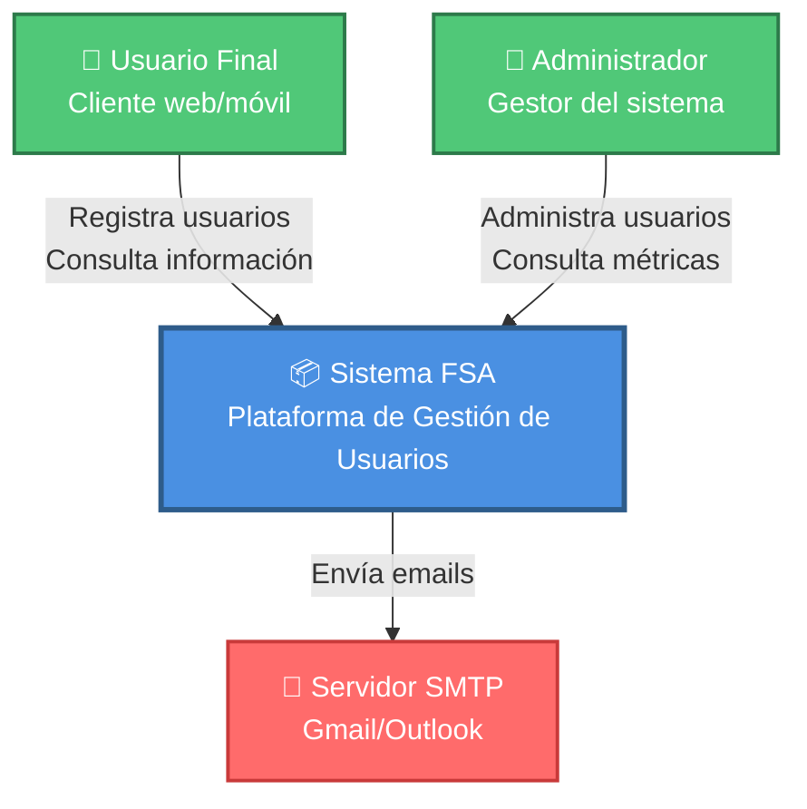
```mermaid
graph TB
    User[👤 Usuario Final<br/>Cliente web/móvil]
    Admin[👤 Administrador<br/>Gestor del sistema]
    
    FSA[📦 Sistema FSA<br/>Plataforma de Gestión de Usuarios]
    
    SMTP[📧 Servidor SMTP<br/>Gmail/Outlook]
    
    User -->|Registra usuarios<br/>Consulta información| FSA
    Admin -->|Administra usuarios<br/>Consulta métricas| FSA
    FSA -->|Envía emails| SMTP
    
    style FSA fill:#4A90E2,stroke:#2E5C8A,stroke-width:3px,color:#fff
    style User fill:#50C878,stroke:#2D7A4A,stroke-width:2px,color:#fff
    style Admin fill:#50C878,stroke:#2D7A4A,stroke-width:2px,color:#fff
    style SMTP fill:#FF6B6B,stroke:#C93A3A,stroke-width:2px,color:#fff
```

**Elementos:**

| Elemento | Tipo | Descripción |
|----------|------|-------------|
| **Usuario Final** | Actor | Cliente que se registra y consulta su información |
| **Administrador** | Actor | Gestiona usuarios y consulta métricas del sistema |
| **Sistema FSA** | Sistema de Software | Plataforma de gestión de usuarios con arquitectura de microservicios |
| **Servidor SMTP** | Sistema Externo | Servicio de correo electrónico (Gmail, Outlook) |

**Responsabilidades del Sistema:**
- Gestionar el ciclo de vida de usuarios
- Enviar notificaciones por email
- Generar métricas y reportes
- Garantizar consistencia de datos

---

### Nivel 2: Contenedores

**Descripción:** Muestra los contenedores (aplicaciones, bases de datos, sistemas de mensajería) que componen el sistema FSA.

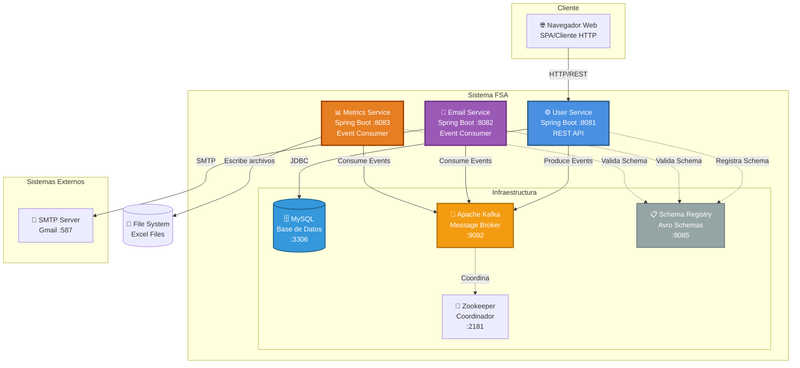
```mermaid
graph TB
    subgraph "Cliente"
        Browser[🌐 Navegador Web<br/>SPA/Cliente HTTP]
    end
    
    subgraph "Sistema FSA"
        US[⚙️ User Service<br/>Spring Boot :8081<br/>REST API]
        ES[📧 Email Service<br/>Spring Boot :8082<br/>Event Consumer]
        MS[📊 Metrics Service<br/>Spring Boot :8083<br/>Event Consumer]
        
        subgraph "Infraestructura"
            MySQL[(🗄️ MySQL<br/>Base de Datos<br/>:3306)]
            Kafka[📨 Apache Kafka<br/>Message Broker<br/>:9092]
            SR[📋 Schema Registry<br/>Avro Schemas<br/>:8085]
            ZK[🔧 Zookeeper<br/>Coordinador<br/>:2181]
        end
    end
    
    subgraph "Sistemas Externos"
        SMTP[📧 SMTP Server<br/>Gmail :587]
    end
    
    Browser -->|HTTP/REST| US
    US -->|JDBC| MySQL
    US -->|Produce Events| Kafka
    US -.->|Registra Schema| SR
    ES -->|Consume Events| Kafka
    MS -->|Consume Events| Kafka
    ES -.->|Valida Schema| SR
    MS -.->|Valida Schema| SR
    ES -->|SMTP| SMTP
    MS -->|Escribe archivos| FileSystem[(📁 File System<br/>Excel Files)]
    Kafka -.->|Coordina| ZK
    
    style US fill:#4A90E2,stroke:#2E5C8A,stroke-width:3px,color:#fff
    style ES fill:#9B59B6,stroke:#6C3483,stroke-width:3px,color:#fff
    style MS fill:#E67E22,stroke:#A04000,stroke-width:3px,color:#fff
    style Kafka fill:#F39C12,stroke:#B9770E,stroke-width:3px,color:#fff
    style MySQL fill:#3498DB,stroke:#1F618D,stroke-width:2px,color:#fff
    style SR fill:#95A5A6,stroke:#707B7C,stroke-width:2px,color:#fff
```

**Componentes Principales:**

| Contenedor | Tecnología | Puerto | Responsabilidad |
|------------|------------|--------|-----------------|
| **User Service** | Spring Boot 3.5.7, Java 21 | 8081 | API REST para gestión de usuarios. Publica eventos de registro. |
| **Email Service** | Spring Boot 3.5.7, Java 21 | 8082 | Consume eventos de registro y envía emails de bienvenida. |
| **Metrics Service** | Spring Boot 3.5.7, Java 21 | 8083 | Consume eventos de registro y genera reportes en Excel. |
| **MySQL** | MySQL 8.0 | 3306 | Almacenamiento persistente de usuarios. |
| **Apache Kafka** | Confluent 7.5.0 | 9092 | Message broker para comunicación asíncrona. |
| **Schema Registry** | Confluent 7.5.0 | 8085 | Gestión y validación de esquemas Avro. |
| **Zookeeper** | Confluent 7.5.0 | 2181 | Coordinación de cluster Kafka. |

**Flujo de Datos:**

1. Cliente HTTP → User Service (REST)
2. User Service → MySQL (Persistencia)
3. User Service → Kafka (Evento: UserRegisteredEvent)
4. Kafka → Email Service (Consumidor)
5. Kafka → Metrics Service (Consumidor)
6. Email Service → SMTP Server (Envío de email)
7. Metrics Service → File System (Guardado de Excel)

---

### Nivel 3: Componentes

**Descripción:** Detalla los componentes internos de cada microservicio siguiendo Arquitectura Hexagonal (Ports & Adapters).

#### 3.1. User Service - Componentes

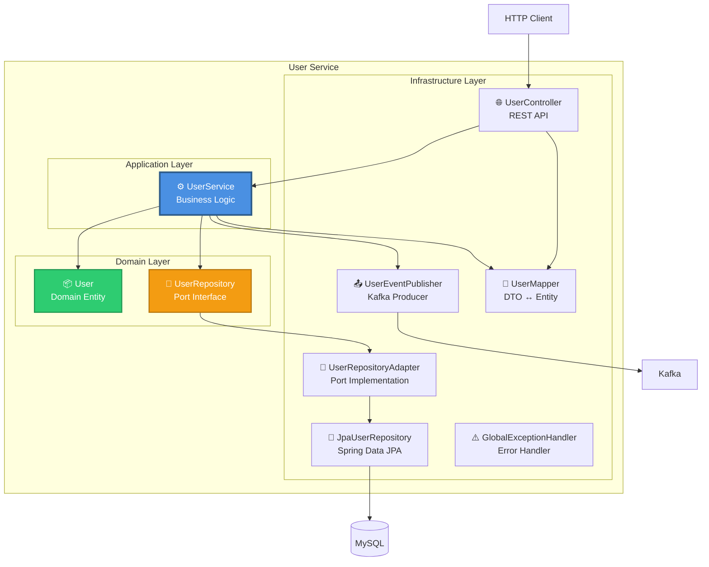
```mermaid
graph TB
    subgraph "User Service"
        subgraph "Infrastructure Layer"
            Controller[🌐 UserController<br/>REST API]
            JpaRepo[💾 JpaUserRepository<br/>Spring Data JPA]
            RepoAdapter[🔌 UserRepositoryAdapter<br/>Port Implementation]
            EventPublisher[📤 UserEventPublisher<br/>Kafka Producer]
            ExHandler[⚠️ GlobalExceptionHandler<br/>Error Handler]
            Mapper[🔄 UserMapper<br/>DTO ↔ Entity]
        end
        
        subgraph "Application Layer"
            Service[⚙️ UserService<br/>Business Logic]
        end
        
        subgraph "Domain Layer"
            Model[📦 User<br/>Domain Entity]
            Port[🔌 UserRepository<br/>Port Interface]
        end
    end
    
    Client[HTTP Client] --> Controller
    Controller --> Service
    Service --> Port
    Port --> RepoAdapter
    RepoAdapter --> JpaRepo
    Service --> EventPublisher
    Controller --> Mapper
    Service --> Mapper
    Service --> Model
    
    JpaRepo --> MySQL[(MySQL)]
    EventPublisher --> Kafka[Kafka]
    
    style Service fill:#4A90E2,stroke:#2E5C8A,stroke-width:3px,color:#fff
    style Model fill:#2ECC71,stroke:#229954,stroke-width:2px,color:#fff
    style Port fill:#F39C12,stroke:#B9770E,stroke-width:2px,color:#fff
```

**Componentes de User Service:**

| Componente | Responsabilidad | Patrón |
|------------|-----------------|--------|
| **UserController** | Expone endpoints REST (CRUD usuarios) | Adapter (REST) |
| **UserService** | Lógica de negocio, orquestación | Application Service |
| **User** | Modelo de dominio (entidad JPA) | Domain Model |
| **UserRepository (Port)** | Interfaz de persistencia | Port (Hexagonal) |
| **UserRepositoryAdapter** | Implementación del puerto | Adapter |
| **JpaUserRepository** | Acceso a datos con Spring Data | Repository |
| **UserEventPublisher** | Publicación de eventos a Kafka | Adapter (Messaging) |
| **UserMapper** | Transformación DTO ↔ Entity | Mapper |
| **GlobalExceptionHandler** | Manejo centralizado de errores | Exception Handler |

**DTOs:**
- `UserCreateDTO`: Datos para crear usuario
- `UserUpdateDTO`: Datos para actualizar usuario
- `UserResponseDTO`: Respuesta con datos del usuario

#### 3.2. Email Service - Componentes

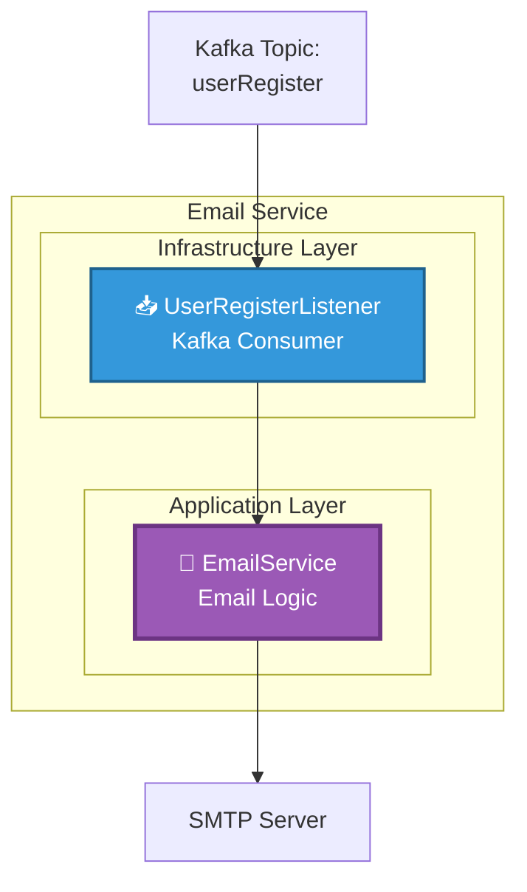
```mermaid
graph TB
    subgraph "Email Service"
        subgraph "Infrastructure Layer"
            Listener[📥 UserRegisterListener<br/>Kafka Consumer]
        end
        
        subgraph "Application Layer"
            EmailSvc[📧 EmailService<br/>Email Logic]
        end
    end
    
    Kafka[Kafka Topic:<br/>userRegister] --> Listener
    Listener --> EmailSvc
    EmailSvc --> SMTP[SMTP Server]
    
    style EmailSvc fill:#9B59B6,stroke:#6C3483,stroke-width:3px,color:#fff
    style Listener fill:#3498DB,stroke:#1F618D,stroke-width:2px,color:#fff
```

**Componentes de Email Service:**

| Componente | Responsabilidad |
|------------|-----------------|
| **UserRegisterListener** | Consume eventos UserRegisteredEvent desde Kafka |
| **EmailService** | Construye y envía emails usando JavaMailSender |

#### 3.3. Metrics Service - Componentes

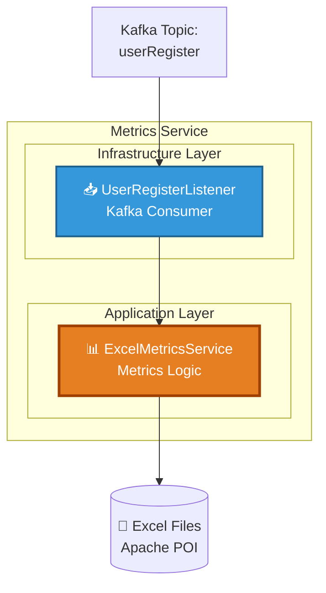
```mermaid
graph TB
    subgraph "Metrics Service"
        subgraph "Infrastructure Layer"
            Listener[📥 UserRegisterListener<br/>Kafka Consumer]
        end
        
        subgraph "Application Layer"
            MetricsSvc[📊 ExcelMetricsService<br/>Metrics Logic]
        end
    end
    
    Kafka[Kafka Topic:<br/>userRegister] --> Listener
    Listener --> MetricsSvc
    MetricsSvc --> Excel[(📁 Excel Files<br/>Apache POI)]
    
    style MetricsSvc fill:#E67E22,stroke:#A04000,stroke-width:3px,color:#fff
    style Listener fill:#3498DB,stroke:#1F618D,stroke-width:2px,color:#fff
```

**Componentes de Metrics Service:**

| Componente | Responsabilidad |
|------------|-----------------|
| **UserRegisterListener** | Consume eventos UserRegisteredEvent desde Kafka |
| **ExcelMetricsService** | Genera y actualiza archivos Excel con métricas usando Apache POI |

---

### Nivel 4: Código

**Descripción:** Muestra la implementación a nivel de clases y métodos principales.

#### 4.1. Modelo de Dominio - User

```java
@Entity
@Table(name = "users")
public class User {
    @Id
    @GeneratedValue(strategy = GenerationType.UUID)
    private UUID id;
    
    @Column(nullable = false)
    private String nombre;
    
    @Column(nullable = false)
    private String apellido;
    
    @Column(nullable = false)
    private Integer edad;
    
    @Column(nullable = false, unique = true)
    private String email;
    
    private String telefono;
    private String direccion;
}
```

#### 4.2. Evento - UserRegisteredEvent (Avro Schema)

```json
{
  "type": "record",
  "name": "UserRegisteredEvent",
  "namespace": "com.funlam.userservice.events",
  "fields": [
    {"name": "id", "type": "string"},
    {"name": "nombre", "type": "string"},
    {"name": "apellido", "type": "string"},
    {"name": "edad", "type": "int"},
    {"name": "email", "type": "string"},
    {"name": "telefono", "type": ["null", "string"]},
    {"name": "direccion", "type": ["null", "string"]}
  ]
}
```

#### 4.3. Diagrama de Clases - User Service

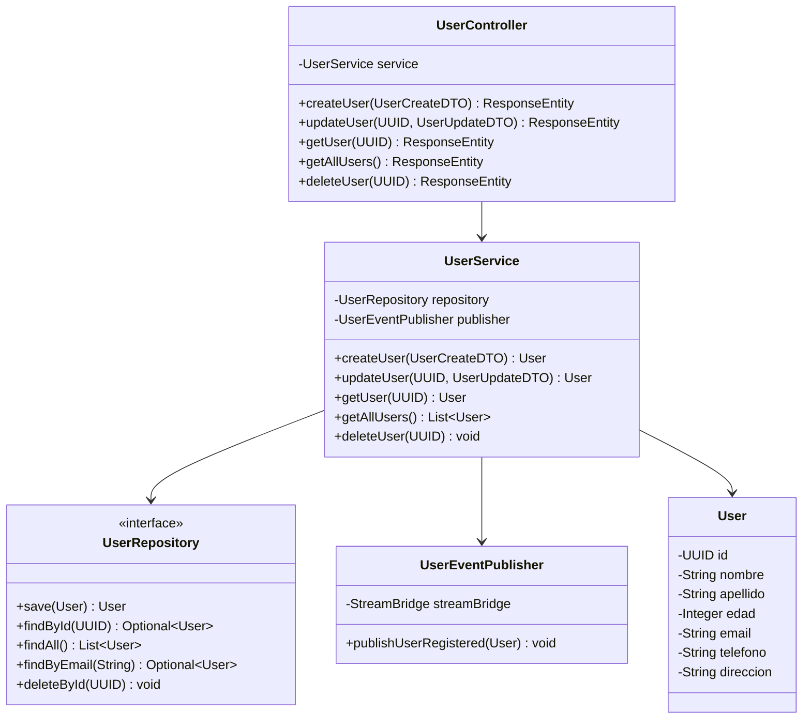
```mermaid
classDiagram
    class User {
        -UUID id
        -String nombre
        -String apellido
        -Integer edad
        -String email
        -String telefono
        -String direccion
    }
    
    class UserRepository {
        <<interface>>
        +save(User) User
        +findById(UUID) Optional~User~
        +findAll() List~User~
        +findByEmail(String) Optional~User~
        +deleteById(UUID) void
    }
    
    class UserService {
        -UserRepository repository
        -UserEventPublisher publisher
        +createUser(UserCreateDTO) User
        +updateUser(UUID, UserUpdateDTO) User
        +getUser(UUID) User
        +getAllUsers() List~User~
        +deleteUser(UUID) void
    }
    
    class UserController {
        -UserService service
        +createUser(UserCreateDTO) ResponseEntity
        +updateUser(UUID, UserUpdateDTO) ResponseEntity
        +getUser(UUID) ResponseEntity
        +getAllUsers() ResponseEntity
        +deleteUser(UUID) ResponseEntity
    }
    
    class UserEventPublisher {
        -StreamBridge streamBridge
        +publishUserRegistered(User) void
    }
    
    UserController --> UserService
    UserService --> UserRepository
    UserService --> UserEventPublisher
    UserService --> User
```

---

## Vistas 4+1

Las vistas 4+1 de Kruchten proporcionan diferentes perspectivas de la arquitectura para distintos stakeholders.

### Vista Lógica

**Propósito:** Muestra la funcionalidad que el sistema proporciona a los usuarios finales. Se enfoca en la organización funcional del sistema.

**Stakeholders:** Usuarios finales, analistas de negocio, arquitectos

#### Diagrama de Paquetes

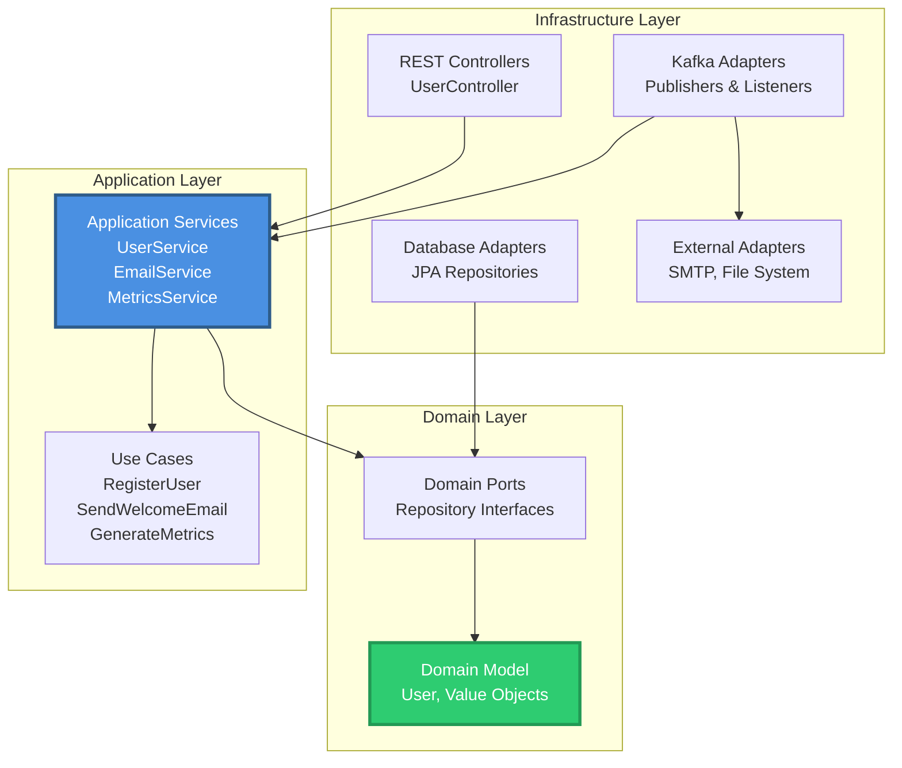
```mermaid
graph TB
    subgraph "Domain Layer"
        DM[Domain Model<br/>User, Value Objects]
        DP[Domain Ports<br/>Repository Interfaces]
    end
    
    subgraph "Application Layer"
        AS[Application Services<br/>UserService<br/>EmailService<br/>MetricsService]
        UC[Use Cases<br/>RegisterUser<br/>SendWelcomeEmail<br/>GenerateMetrics]
    end
    
    subgraph "Infrastructure Layer"
        REST[REST Controllers<br/>UserController]
        KAFKA[Kafka Adapters<br/>Publishers & Listeners]
        DB[Database Adapters<br/>JPA Repositories]
        EXT[External Adapters<br/>SMTP, File System]
    end
    
    REST --> AS
    KAFKA --> AS
    AS --> UC
    AS --> DP
    DP --> DM
    DB --> DP
    KAFKA --> EXT
    
    style DM fill:#2ECC71,stroke:#229954,stroke-width:3px,color:#fff
    style AS fill:#4A90E2,stroke:#2E5C8A,stroke-width:3px,color:#fff
```

#### Módulos Funcionales

| Módulo | Responsabilidad | Componentes |
|--------|-----------------|-------------|
| **User Management** | Gestión completa del ciclo de vida de usuarios | UserService, UserController, UserRepository |
| **Event Publishing** | Publicación de eventos de negocio | UserEventPublisher, Kafka Producer |
| **Email Notifications** | Envío de notificaciones por correo | EmailService, UserRegisterListener, JavaMailSender |
| **Metrics & Analytics** | Generación de métricas y reportes | MetricsService, ExcelMetricsService, Apache POI |

#### Patrones Aplicados

- **Arquitectura Hexagonal (Ports & Adapters)**: Separación entre dominio e infraestructura
- **Repository Pattern**: Abstracción del acceso a datos
- **Event-Driven Architecture**: Comunicación basada en eventos
- **CQRS (Command Query Responsibility Segregation)**: Separación de escritura (User Service) y lectura (Metrics)
- **DTO Pattern**: Transferencia de datos entre capas

---

### Vista de Desarrollo

**Propósito:** Muestra la organización del código desde la perspectiva del desarrollador. Estructura de módulos, paquetes y dependencias.

**Stakeholders:** Desarrolladores, arquitectos de software

#### Estructura de Módulos Maven

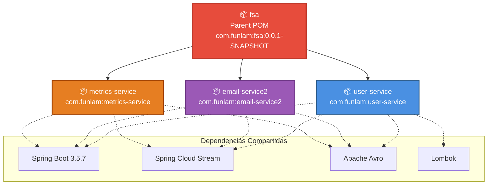
```mermaid
graph TB
    ROOT[📦 fsa<br/>Parent POM<br/>com.funlam:fsa:0.0.1-SNAPSHOT]
    
    US[📦 user-service<br/>com.funlam:user-service]
    ES[📦 email-service2<br/>com.funlam:email-service2]
    MS[📦 metrics-service<br/>com.funlam:metrics-service]
    
    ROOT --> US
    ROOT --> ES
    ROOT --> MS
    
    subgraph "Dependencias Compartidas"
        SB[Spring Boot 3.5.7]
        KAFKA[Spring Cloud Stream]
        AVRO[Apache Avro]
        LOMBOK[Lombok]
    end
    
    US -.-> SB
    US -.-> KAFKA
    US -.-> AVRO
    US -.-> LOMBOK
    
    ES -.-> SB
    ES -.-> KAFKA
    ES -.-> AVRO
    
    MS -.-> SB
    MS -.-> KAFKA
    MS -.-> AVRO
    
    style ROOT fill:#E74C3C,stroke:#C0392B,stroke-width:3px,color:#fff
    style US fill:#4A90E2,stroke:#2E5C8A,stroke-width:2px,color:#fff
    style ES fill:#9B59B6,stroke:#6C3483,stroke-width:2px,color:#fff
    style MS fill:#E67E22,stroke:#A04000,stroke-width:2px,color:#fff
```

#### Estructura de Paquetes por Servicio

**User Service:**
```
com.funlam.userservice
├── domain
│   ├── model
│   │   └── User.java
│   └── port
│       └── UserRepository.java (interface)
├── application
│   └── service
│       └── UserService.java
└── infrastructure
    ├── controller
    │   ├── UserController.java
    │   └── dto
    │       ├── UserCreateDTO.java
    │       ├── UserUpdateDTO.java
    │       └── UserResponseDTO.java
    ├── repository
    │   └── JpaUserRepository.java
    ├── adapter
    │   └── UserRepositoryAdapter.java
    ├── messaging
    │   └── publisher
    │       └── UserEventPublisher.java
    ├── mapper
    │   └── UserMapper.java
    ├── exception
    │   ├── GlobalExceptionHandler.java
    │   └── ErrorResponse.java
    └── config
        └── OpenAPIConfig.java
```

**Email Service:**
```
com.funlam.emailservice2
├── application
│   └── EmailService.java
└── infrastructure
    └── messaging
        └── listeners
            └── UserRegisterListener.java
```

**Metrics Service:**
```
com.funlam.metricsservice
├── application
│   └── ExcelMetricsService.java
└── infrastructure
    └── messaging
        └── listeners
            └── UserRegisterListener.java
```

#### Diagrama de Dependencias

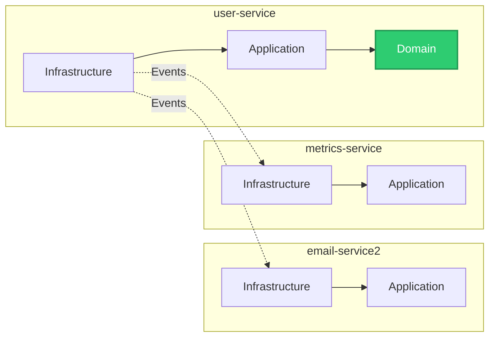
```mermaid
graph LR
    subgraph "user-service"
        US_DOM[Domain]
        US_APP[Application]
        US_INF[Infrastructure]
    end
    
    subgraph "email-service2"
        ES_APP[Application]
        ES_INF[Infrastructure]
    end
    
    subgraph "metrics-service"
        MS_APP[Application]
        MS_INF[Infrastructure]
    end
    
    US_INF --> US_APP
    US_APP --> US_DOM
    
    ES_INF --> ES_APP
    MS_INF --> MS_APP
    
    US_INF -.->|Events| ES_INF
    US_INF -.->|Events| MS_INF
    
    style US_DOM fill:#2ECC71,stroke:#229954,stroke-width:2px,color:#fff
```

#### Tecnologías y Frameworks

| Capa | Tecnologías |
|------|-------------|
| **Lenguaje** | Java 21 |
| **Framework** | Spring Boot 3.5.7 |
| **Web** | Spring Web MVC, REST |
| **Persistencia** | Spring Data JPA, Hibernate, MySQL Connector |
| **Mensajería** | Spring Cloud Stream, Kafka Binder |
| **Serialización** | Apache Avro, Confluent Schema Registry |
| **Email** | Spring Boot Mail, JavaMailSender |
| **Excel** | Apache POI |
| **Documentación API** | SpringDoc OpenAPI (Swagger) |
| **Build** | Maven 3.x |
| **Contenedores** | Docker, Docker Compose |

---

### Vista de Procesos

**Propósito:** Muestra los procesos del sistema en tiempo de ejecución, concurrencia, sincronización y comunicación entre procesos.

**Stakeholders:** Integradores, arquitectos de sistemas, ingenieros de performance

#### Diagrama de Secuencia - Registro de Usuario

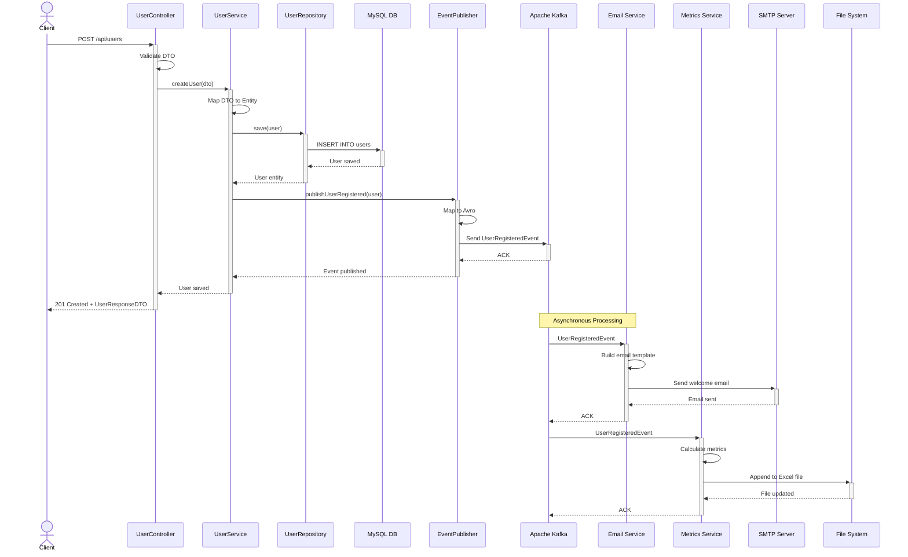
```mermaid
sequenceDiagram
    actor Client
    participant UC as UserController
    participant US as UserService
    participant Repo as UserRepository
    participant MySQL as MySQL DB
    participant Pub as EventPublisher
    participant Kafka as Apache Kafka
    participant ES as Email Service
    participant MS as Metrics Service
    participant SMTP as SMTP Server
    participant FS as File System
    
    Client->>+UC: POST /api/users
    UC->>UC: Validate DTO
    UC->>+US: createUser(dto)
    
    US->>US: Map DTO to Entity
    US->>+Repo: save(user)
    Repo->>+MySQL: INSERT INTO users
    MySQL-->>-Repo: User saved
    Repo-->>-US: User entity
    
    US->>+Pub: publishUserRegistered(user)
    Pub->>Pub: Map to Avro
    Pub->>+Kafka: Send UserRegisteredEvent
    Kafka-->>-Pub: ACK
    Pub-->>-US: Event published
    
    US-->>-UC: User saved
    UC-->>-Client: 201 Created + UserResponseDTO
    
    Note over Kafka,ES: Asynchronous Processing
    
    Kafka->>+ES: UserRegisteredEvent
    ES->>ES: Build email template
    ES->>+SMTP: Send welcome email
    SMTP-->>-ES: Email sent
    ES-->>-Kafka: ACK
    
    Kafka->>+MS: UserRegisteredEvent
    MS->>MS: Calculate metrics
    MS->>+FS: Append to Excel file
    FS-->>-MS: File updated
    MS-->>-Kafka: ACK
```

#### Diagrama de Actividades - Flujo Completo

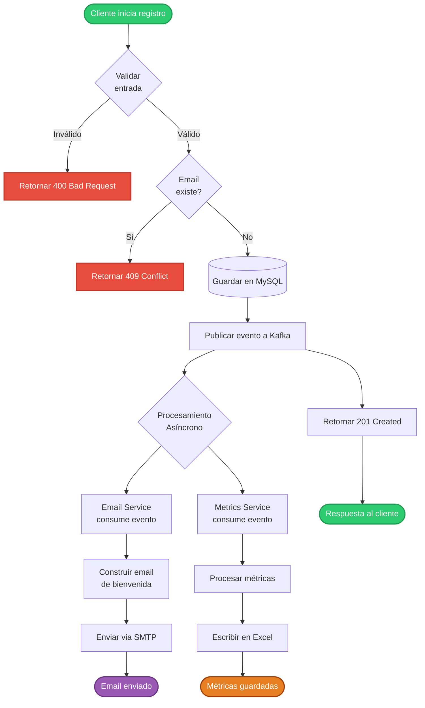
```mermaid
flowchart TD
    Start([Cliente inicia registro]) --> ValidateInput{Validar<br/>entrada}
    ValidateInput -->|Inválido| Error1[Retornar 400 Bad Request]
    ValidateInput -->|Válido| CheckEmail{Email<br/>existe?}
    
    CheckEmail -->|Sí| Error2[Retornar 409 Conflict]
    CheckEmail -->|No| SaveDB[(Guardar en MySQL)]
    
    SaveDB --> PublishEvent[Publicar evento a Kafka]
    PublishEvent --> Return[Retornar 201 Created]
    
    PublishEvent --> Async{Procesamiento<br/>Asíncrono}
    
    Async --> EmailConsumer[Email Service<br/>consume evento]
    Async --> MetricsConsumer[Metrics Service<br/>consume evento]
    
    EmailConsumer --> BuildEmail[Construir email<br/>de bienvenida]
    BuildEmail --> SendEmail[Enviar via SMTP]
    SendEmail --> EmailEnd([Email enviado])
    
    MetricsConsumer --> ProcessMetrics[Procesar métricas]
    ProcessMetrics --> WriteExcel[Escribir en Excel]
    WriteExcel --> MetricsEnd([Métricas guardadas])
    
    Return --> End([Respuesta al cliente])
    
    style Start fill:#2ECC71,stroke:#229954,stroke-width:2px,color:#fff
    style End fill:#2ECC71,stroke:#229954,stroke-width:2px,color:#fff
    style EmailEnd fill:#9B59B6,stroke:#6C3483,stroke-width:2px,color:#fff
    style MetricsEnd fill:#E67E22,stroke:#A04000,stroke-width:2px,color:#fff
    style Error1 fill:#E74C3C,stroke:#C0392B,stroke-width:2px,color:#fff
    style Error2 fill:#E74C3C,stroke:#C0392B,stroke-width:2px,color:#fff
```

#### Procesos y Threads

| Servicio | Proceso | Concurrencia | Descripción |
|----------|---------|--------------|-------------|
| **User Service** | JVM Process | Thread Pool (Tomcat) | Gestiona peticiones HTTP concurrentes. Pool por defecto: 200 threads |
| **Email Service** | JVM Process | Kafka Consumer Thread | Procesa mensajes de forma secuencial del topic userRegister |
| **Metrics Service** | JVM Process | Kafka Consumer Thread | Procesa mensajes de forma secuencial del topic userRegister |
| **Kafka** | Multiple Processes | Partitions & Consumer Groups | Paralelismo mediante particiones. Cada servicio en su propio grupo |
| **MySQL** | Database Process | Connection Pool (HikariCP) | Pool de conexiones: min=10, max=20 |

#### Estrategias de Concurrencia

- **User Service**: Maneja múltiples requests HTTP simultáneos usando thread pool de Tomcat
- **Event Consumers**: Procesamiento secuencial garantiza orden de eventos por partición
- **Database**: Connection pooling para optimizar acceso concurrente a MySQL
- **Kafka**: Consumer groups independientes permiten procesamiento paralelo entre servicios

---

### Vista Física

**Propósito:** Muestra cómo los componentes de software se mapean al hardware físico y la infraestructura de red.

**Stakeholders:** Ingenieros de sistemas, DevOps, ingenieros de red

#### Diagrama de Despliegue - Entorno Local (Docker Compose)

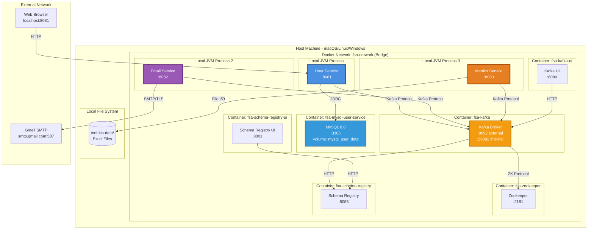
```mermaid
graph TB
    subgraph "Host Machine - macOS/Linux/Windows"
        subgraph "Docker Network: fsa-network (Bridge)"
            subgraph "Container: fsa-mysql-user-service"
                MySQL[MySQL 8.0<br/>:3306<br/>Volume: mysql_user_data]
            end
            
            subgraph "Container: fsa-zookeeper"
                ZK[Zookeeper<br/>:2181]
            end
            
            subgraph "Container: fsa-kafka"
                KAFKA[Kafka Broker<br/>:9092 external<br/>:29092 internal]
            end
            
            subgraph "Container: fsa-schema-registry"
                SR[Schema Registry<br/>:8085]
            end
            
            subgraph "Container: fsa-kafka-ui"
                KUI[Kafka UI<br/>:8080]
            end
            
            subgraph "Container: fsa-schema-registry-ui"
                SRUI[Schema Registry UI<br/>:8001]
            end
            
            subgraph "Local JVM Process"
                US[User Service<br/>:8081]
            end
            
            subgraph "Local JVM Process 2"
                ES[Email Service<br/>:8082]
            end
            
            subgraph "Local JVM Process 3"
                MS[Metrics Service<br/>:8083]
            end
        end
        
        subgraph "Local File System"
            METRICS[(metrics-data/<br/>Excel Files)]
        end
    end
    
    subgraph "External Network"
        SMTP[Gmail SMTP<br/>smtp.gmail.com:587]
        BROWSER[Web Browser<br/>localhost:8081]
    end
    
    BROWSER -->|HTTP| US
    US -->|JDBC| MySQL
    US -->|Kafka Protocol| KAFKA
    ES -->|Kafka Protocol| KAFKA
    MS -->|Kafka Protocol| KAFKA
    KAFKA -->|ZK Protocol| ZK
    KAFKA -->|HTTP| SR
    ES -->|SMTP/TLS| SMTP
    MS -->|File I/O| METRICS
    KUI -->|HTTP| KAFKA
    SRUI -->|HTTP| SR
    
    style MySQL fill:#3498DB,stroke:#1F618D,stroke-width:2px,color:#fff
    style KAFKA fill:#F39C12,stroke:#B9770E,stroke-width:3px,color:#fff
    style US fill:#4A90E2,stroke:#2E5C8A,stroke-width:3px,color:#fff
    style ES fill:#9B59B6,stroke:#6C3483,stroke-width:3px,color:#fff
    style MS fill:#E67E22,stroke:#A04000,stroke-width:3px,color:#fff
```

#### Mapeo de Puertos

| Servicio | Puerto Host | Puerto Container | Protocolo | Acceso |
|----------|-------------|------------------|-----------|--------|
| **User Service** | 8081 | N/A (local) | HTTP | localhost:8081 |
| **Email Service** | 8082 | N/A (local) | HTTP | localhost:8082 |
| **Metrics Service** | 8083 | N/A (local) | HTTP | localhost:8083 |
| **MySQL** | 3306 | 3306 | TCP/MySQL | localhost:3306 |
| **Kafka** | 9092 | 9092, 29092 | TCP/Kafka | localhost:9092 |
| **Zookeeper** | 2181 | 2181 | TCP | localhost:2181 |
| **Schema Registry** | 8085 | 8081 | HTTP | localhost:8085 |
| **Kafka UI** | 8080 | 8080 | HTTP | localhost:8080 |
| **Schema Registry UI** | 8001 | 8000 | HTTP | localhost:8001 |

#### Volúmenes Persistentes

| Volumen | Tipo | Propósito | Ubicación |
|---------|------|-----------|-----------|
| **mysql_user_data** | Docker Volume | Persistencia de base de datos | /var/lib/mysql |
| **metrics-data** | Bind Mount | Almacenamiento de archivos Excel | ./metrics-data/ |

#### Health Checks

Cada contenedor implementa health checks para garantizar disponibilidad:

```yaml
# MySQL
healthcheck:
  test: mysqladmin ping -h localhost -u root -proot
  interval: 10s
  timeout: 5s
  retries: 5

# Kafka
healthcheck:
  test: kafka-broker-api-versions --bootstrap-server localhost:9092
  interval: 10s
  timeout: 10s
  retries: 5

# Schema Registry
healthcheck:
  test: curl -f http://localhost:8081/
  interval: 10s
  timeout: 5s
  retries: 5
```

#### Diagrama de Despliegue - Entorno Productivo (Propuesto)

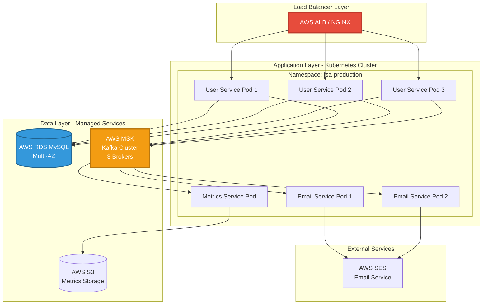
```mermaid
graph TB
    subgraph "Load Balancer Layer"
        LB[AWS ALB / NGINX]
    end
    
    subgraph "Application Layer - Kubernetes Cluster"
        subgraph "Namespace: fsa-production"
            US1[User Service Pod 1]
            US2[User Service Pod 2]
            US3[User Service Pod 3]
            
            ES1[Email Service Pod 1]
            ES2[Email Service Pod 2]
            
            MS1[Metrics Service Pod]
        end
    end
    
    subgraph "Data Layer - Managed Services"
        RDS[(AWS RDS MySQL<br/>Multi-AZ)]
        MSK[AWS MSK<br/>Kafka Cluster<br/>3 Brokers]
        S3[(AWS S3<br/>Metrics Storage)]
    end
    
    subgraph "External Services"
        SES[AWS SES<br/>Email Service]
    end
    
    LB --> US1
    LB --> US2
    LB --> US3
    
    US1 --> RDS
    US2 --> RDS
    US3 --> RDS
    
    US1 --> MSK
    US2 --> MSK
    US3 --> MSK
    
    MSK --> ES1
    MSK --> ES2
    MSK --> MS1
    
    ES1 --> SES
    ES2 --> SES
    MS1 --> S3
    
    style LB fill:#E74C3C,stroke:#C0392B,stroke-width:3px,color:#fff
    style RDS fill:#3498DB,stroke:#1F618D,stroke-width:2px,color:#fff
    style MSK fill:#F39C12,stroke:#B9770E,stroke-width:3px,color:#fff
```

#### Escalabilidad y Disponibilidad

| Componente | Instancias | Estrategia de Escalado | HA |
|------------|-----------|------------------------|-----|
| **User Service** | 3+ pods | Horizontal (HPA) basado en CPU/Requests | ✅ Load balanced |
| **Email Service** | 2+ pods | Horizontal basado en Kafka lag | ✅ Consumer group |
| **Metrics Service** | 1-2 pods | Vertical scaling | ⚠️ Single writer |
| **MySQL** | 1 master + replicas | Read replicas | ✅ Multi-AZ |
| **Kafka** | 3+ brokers | Static cluster | ✅ Replication factor 3 |

---

### Escenarios (Casos de Uso)

**Propósito:** Ilustra cómo los diferentes elementos arquitectónicos trabajan juntos para cumplir con los requisitos funcionales principales.

**Stakeholders:** Todos los stakeholders

#### Caso de Uso 1: Registro de Nuevo Usuario

**Actor Principal:** Usuario Final

**Precondiciones:** 
- Sistema FSA está operativo
- Email no existe en la base de datos

**Flujo Principal:**

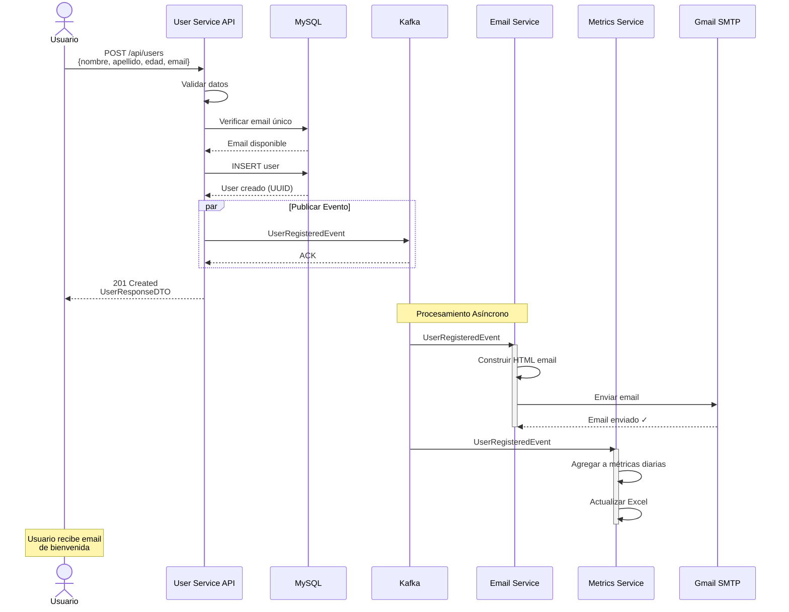
```mermaid
sequenceDiagram
    actor U as Usuario
    participant API as User Service API
    participant DB as MySQL
    participant K as Kafka
    participant E as Email Service
    participant M as Metrics Service
    participant SMTP as Gmail SMTP
    
    U->>API: POST /api/users<br/>{nombre, apellido, edad, email}
    
    API->>API: Validar datos
    API->>DB: Verificar email único
    DB-->>API: Email disponible
    
    API->>DB: INSERT user
    DB-->>API: User creado (UUID)
    
    par Publicar Evento
        API->>K: UserRegisteredEvent
        K-->>API: ACK
    end
    
    API-->>U: 201 Created<br/>UserResponseDTO
    
    Note over K,E: Procesamiento Asíncrono
    
    K->>E: UserRegisteredEvent
    activate E
    E->>E: Construir HTML email
    E->>SMTP: Enviar email
    SMTP-->>E: Email enviado ✓
    deactivate E
    
    K->>M: UserRegisteredEvent
    activate M
    M->>M: Agregar a métricas diarias
    M->>M: Actualizar Excel
    deactivate M
    
    Note over U: Usuario recibe email<br/>de bienvenida
```

**Postcondiciones:**
- Usuario almacenado en MySQL con UUID único
- Email de bienvenida enviado
- Métricas actualizadas en archivo Excel
- Evento registrado en Kafka para auditoría

#### Caso de Uso 2: Consulta de Todos los Usuarios

**Actor Principal:** Administrador

**Flujo Principal:**

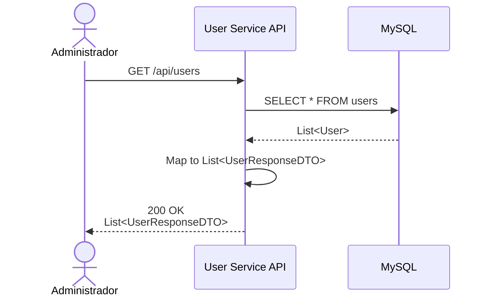
```mermaid
sequenceDiagram
    actor Admin as Administrador
    participant API as User Service API
    participant DB as MySQL
    
    Admin->>API: GET /api/users
    API->>DB: SELECT * FROM users
    DB-->>API: List<User>
    API->>API: Map to List<UserResponseDTO>
    API-->>Admin: 200 OK<br/>List<UserResponseDTO>
```

#### Caso de Uso 3: Actualización de Usuario

**Actor Principal:** Administrador

**Precondiciones:**
- Usuario existe con el ID proporcionado

**Flujo Principal:**

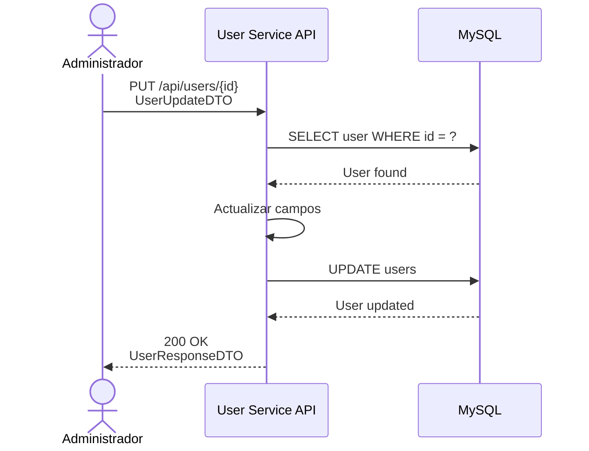
```mermaid
sequenceDiagram
    actor Admin as Administrador
    participant API as User Service API
    participant DB as MySQL
    
    Admin->>API: PUT /api/users/{id}<br/>UserUpdateDTO
    API->>DB: SELECT user WHERE id = ?
    DB-->>API: User found
    API->>API: Actualizar campos
    API->>DB: UPDATE users
    DB-->>API: User updated
    API-->>Admin: 200 OK<br/>UserResponseDTO
```

#### Caso de Uso 4: Generación de Reporte de Métricas

**Actor Principal:** Administrador

**Flujo Principal:**

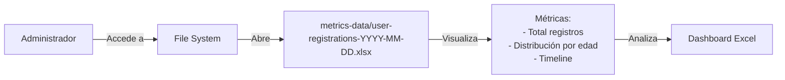
```mermaid
flowchart LR
    A[Administrador] -->|Accede a| B[File System]
    B -->|Abre| C[metrics-data/user-registrations-YYYY-MM-DD.xlsx]
    C -->|Visualiza| D[Métricas:<br/>- Total registros<br/>- Distribución por edad<br/>- Timeline]
    D -->|Analiza| E[Dashboard Excel]
```

#### Escenario de Fallo: Kafka No Disponible

**Situación:** Kafka cluster está caído durante registro de usuario

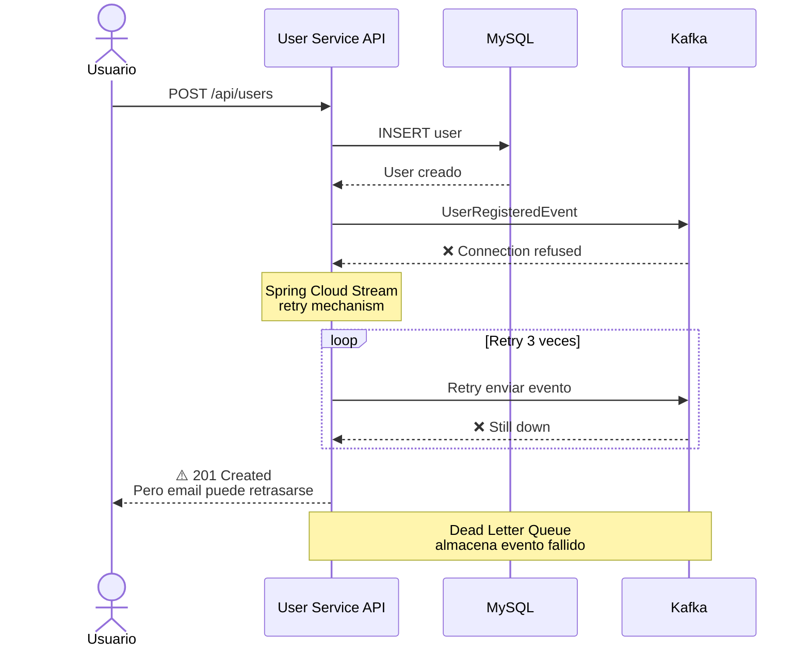
```mermaid
sequenceDiagram
    actor U as Usuario
    participant API as User Service API
    participant DB as MySQL
    participant K as Kafka
    
    U->>API: POST /api/users
    API->>DB: INSERT user
    DB-->>API: User creado
    
    API->>K: UserRegisteredEvent
    K-->>API: ❌ Connection refused
    
    Note over API: Spring Cloud Stream<br/>retry mechanism
    
    loop Retry 3 veces
        API->>K: Retry enviar evento
        K-->>API: ❌ Still down
    end
    
    API-->>U: ⚠️ 201 Created<br/>Pero email puede retrasarse
    
    Note over API,K: Dead Letter Queue<br/>almacena evento fallido
```

**Manejo de Errores:**
- Usuario se guarda correctamente en MySQL (transacción completada)
- Evento se intenta reenviar con retry policy
- Si falla después de reintentos, se envía a Dead Letter Queue
- El usuario recibe confirmación de registro
- Email y métricas se procesarán cuando Kafka vuelva

---

## Decisiones Arquitectónicas (ADRs)

### ADR-001: Arquitectura de Microservicios

**Contexto:** Necesidad de sistema escalable y mantenible

**Decisión:** Implementar arquitectura de microservicios con servicios independientes

**Consecuencias:**
- ✅ Escalabilidad independiente por servicio
- ✅ Equipos pueden trabajar en paralelo
- ✅ Tecnologías pueden variar por servicio
- ⚠️ Complejidad operacional aumenta
- ⚠️ Necesidad de monitoreo distribuido

### ADR-002: Event-Driven Architecture con Kafka

**Contexto:** Necesidad de desacoplar servicios y procesar eventos asíncronamente

**Decisión:** Usar Apache Kafka como message broker central

**Consecuencias:**
- ✅ Desacoplamiento temporal entre servicios
- ✅ Procesamiento asíncrono de notificaciones
- ✅ Capacidad de replay de eventos
- ✅ Escalabilidad mediante particiones
- ⚠️ Eventual consistency
- ⚠️ Infraestructura adicional (Kafka + Zookeeper)

### ADR-003: Schema Registry con Avro

**Contexto:** Necesidad de evolución de esquemas sin romper compatibilidad

**Decisión:** Usar Confluent Schema Registry con serialización Avro

**Consecuencias:**
- ✅ Validación de esquemas en tiempo de producción/consumo
- ✅ Evolución controlada de eventos
- ✅ Serialización binaria eficiente
- ⚠️ Complejidad en setup inicial
- ⚠️ Dependencia adicional

### ADR-004: Arquitectura Hexagonal en Microservicios

**Contexto:** Necesidad de código testeable y mantenible

**Decisión:** Aplicar Ports & Adapters pattern

**Consecuencias:**
- ✅ Dominio independiente de frameworks
- ✅ Fácil testing con mocks
- ✅ Flexibilidad para cambiar infraestructura
- ⚠️ Más clases y abstracciones

### ADR-005: MySQL como Base de Datos Relacional

**Contexto:** Necesidad de almacenamiento ACID para datos de usuarios

**Decisión:** Usar MySQL 8.0 como base de datos principal

**Consecuencias:**
- ✅ ACID transactions
- ✅ Modelo relacional bien conocido
- ✅ Excelente soporte en Spring Data JPA
- ⚠️ Escalabilidad vertical limitada
- ⚠️ Sharding manual si se requiere

---

## Patrones de Integración

### Patrones de Mensajería Implementados

| Patrón | Descripción | Implementación |
|--------|-------------|----------------|
| **Publish-Subscribe** | Múltiples consumidores reciben el mismo evento | User Service publica → Email + Metrics consumen |
| **Event Sourcing** | Eventos como fuente de verdad | Todos los registros generan eventos |
| **Idempotent Consumer** | Consumidores pueden procesar eventos duplicados sin efectos secundarios | Implementado en listeners |
| **Dead Letter Queue** | Eventos fallidos se mueven a topic especial | Configurado en Spring Cloud Stream |
| **Schema Evolution** | Cambios en esquemas manteniendo compatibilidad | Schema Registry + Avro |

### Patrones de Resiliencia

| Patrón | Implementación | Beneficio |
|--------|----------------|-----------|
| **Retry** | Spring Retry en publicadores | Tolerancia a fallos temporales |
| **Health Checks** | Docker healthchecks, Spring Actuator | Detección temprana de problemas |
| **Timeout** | Configurados en Kafka producers/consumers | Evita bloqueos indefinidos |
| **Graceful Degradation** | Sistema funciona aunque falte email/metrics | Disponibilidad parcial |

---

## Calidad de Atributos

### Performance

| Métrica | Objetivo | Implementación |
|---------|----------|----------------|
| **Latencia API** | < 200ms (P95) | Connection pooling, índices DB |
| **Throughput** | 1000 requests/segundo | Escalado horizontal |
| **Event Processing** | < 5 segundos | Consumer threads dedicados |

### Seguridad

| Aspecto | Implementación |
|---------|----------------|
| **Autenticación** | 🔜 Pendiente (Spring Security + JWT) |
| **Autorización** | 🔜 Pendiente (Role-based) |
| **Validación Input** | ✅ Bean Validation en DTOs |
| **SQL Injection** | ✅ JPA PreparedStatements |
| **HTTPS** | 🔜 Recomendado en producción |

### Escalabilidad

- **Horizontal Scaling**: User Service puede escalar a N instancias
- **Vertical Scaling**: Incrementar recursos de contenedores
- **Database**: Read replicas para queries
- **Kafka**: Particiones para paralelismo

### Disponibilidad

- **Objetivo**: 99.9% uptime (SLA)
- **Estrategias**:
  - Multiple instances de User Service
  - Kafka replication factor 3
  - MySQL multi-AZ en producción
  - Health checks y auto-restart

---

## Monitoreo y Observabilidad

### Métricas Clave (Propuestas)

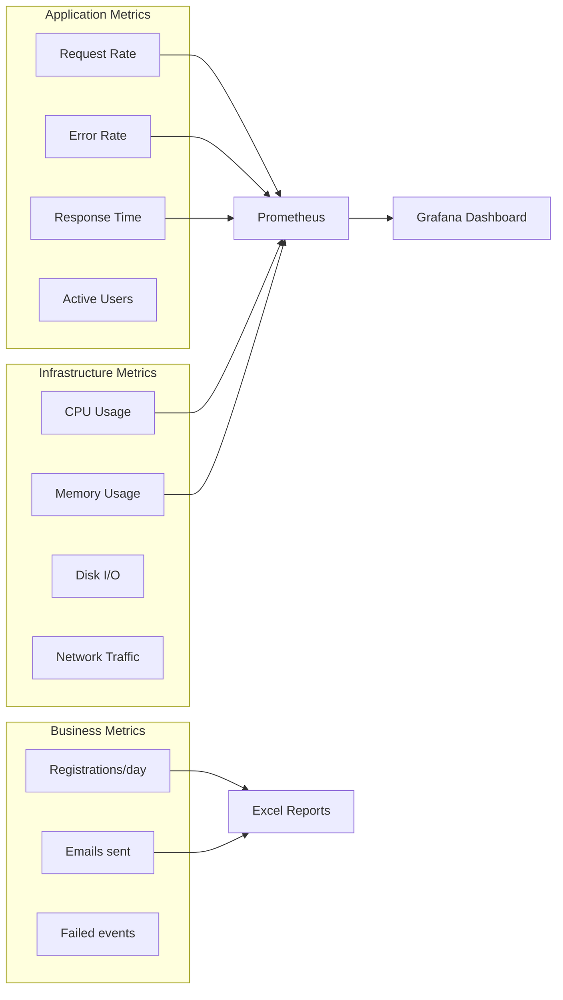
```mermaid
graph LR
    subgraph "Application Metrics"
        M1[Request Rate]
        M2[Error Rate]
        M3[Response Time]
        M4[Active Users]
    end
    
    subgraph "Infrastructure Metrics"
        M5[CPU Usage]
        M6[Memory Usage]
        M7[Disk I/O]
        M8[Network Traffic]
    end
    
    subgraph "Business Metrics"
        M9[Registrations/day]
        M10[Emails sent]
        M11[Failed events]
    end
    
    M1 --> Prometheus[Prometheus]
    M2 --> Prometheus
    M3 --> Prometheus
    M5 --> Prometheus
    M6 --> Prometheus
    
    M9 --> Excel[Excel Reports]
    M10 --> Excel
    
    Prometheus --> Grafana[Grafana Dashboard]
```

### Stack de Observabilidad Recomendado

| Componente | Herramienta | Propósito |
|------------|-------------|-----------|
| **Métricas** | Prometheus + Grafana | Visualización de métricas de sistema |
| **Logs** | ELK Stack (Elasticsearch, Logstash, Kibana) | Agregación y búsqueda de logs |
| **Tracing** | Jaeger / Zipkin | Trazabilidad distribuida de requests |
| **APM** | Spring Boot Actuator | Health checks y métricas de aplicación |

---

## Glosario

| Término | Definición |
|---------|------------|
| **Avro** | Framework de serialización binaria de Apache con soporte para schemas |
| **Consumer Group** | Grupo de consumidores Kafka que comparten la carga de procesamiento |
| **Event-Driven** | Arquitectura donde los componentes se comunican mediante eventos |
| **Hexagonal Architecture** | Patrón que separa lógica de negocio de infraestructura (Ports & Adapters) |
| **Idempotent** | Operación que produce el mismo resultado si se ejecuta múltiples veces |
| **Schema Registry** | Servicio que gestiona y valida esquemas de eventos |
| **Topic** | Canal de mensajes en Kafka donde se publican/consumen eventos |
| **DTO** | Data Transfer Object - objeto para transferir datos entre capas |

---

## Referencias

- [Spring Boot Documentation](https://spring.io/projects/spring-boot)
- [Apache Kafka Documentation](https://kafka.apache.org/documentation/)
- [C4 Model](https://c4model.com/)
- [4+1 Architectural View Model](https://en.wikipedia.org/wiki/4%2B1_architectural_view_model)
- [Hexagonal Architecture](https://alistair.cockburn.us/hexagonal-architecture/)
- [Confluent Schema Registry](https://docs.confluent.io/platform/current/schema-registry/index.html)

---

**Documento creado:** Noviembre 2025  
**Versión:** 1.0.0  
**Mantenido por:** Equipo de Arquitectura FSA

