# Documentación Arquitectónica - Modelo C4

> **Proyecto:** FSA - Final Software Architecture  
> **Versión:** 1.0.0  
> **Fecha:** Noviembre 2025  
> **Arquitectura:** Microservicios orientada a eventos

---

## Tabla de Contenidos

1. [Introducción](#introducción)
2. [Modelo C4](#modelo-c4)
   - [Nivel 1: Contexto del Sistema](#nivel-1-contexto-del-sistema)
   - [Nivel 2: Contenedores](#nivel-2-contenedores)
   - [Nivel 3: Componentes](#nivel-3-componentes)
   - [Nivel 4: Código](#nivel-4-código)
3. [Vistas 4+1](#vistas-41)
   - [Vista Lógica](#vista-lógica)
   - [Vista de Desarrollo](#vista-de-desarrollo)
   - [Vista de Procesos](#vista-de-procesos)
   - [Vista Física](#vista-física)
   - [Escenarios (Casos de Uso)](#escenarios-casos-de-uso)

---

## Introducción

El proyecto FSA implementa un sistema de gestión de usuarios basado en una **arquitectura de microservicios orientada a eventos**. El sistema utiliza patrones modernos como Event-Driven Architecture, CQRS y comunicación asíncrona mediante Apache Kafka.

### Objetivos Arquitectónicos

- ✅ **Desacoplamiento**: Los servicios se comunican de forma asíncrona sin dependencias directas
- ✅ **Escalabilidad**: Cada microservicio puede escalar independientemente
- ✅ **Resiliencia**: Fallos en un servicio no afectan a los demás
- ✅ **Mantenibilidad**: Código organizado siguiendo arquitectura hexagonal
- ✅ **Trazabilidad**: Eventos centralizados para auditoría y métricas

---

## Modelo C4

El Modelo C4 (Context, Containers, Components, Code) proporciona una forma estructurada de documentar la arquitectura del software en diferentes niveles de abstracción.

### Nivel 1: Contexto del Sistema

**Descripción:** Muestra el sistema en su conjunto y cómo interactúa con usuarios externos y sistemas externos.

```mermaid
graph TB
    User[👤 Usuario Final<br/>Cliente web/móvil]
    Admin[👤 Administrador<br/>Gestor del sistema]
    
    FSA[📦 Sistema FSA<br/>Plataforma de Gestión de Usuarios]
    
    SMTP[📧 Servidor SMTP<br/>Gmail/Outlook]
    
    User -->|Registra usuarios<br/>Consulta información| FSA
    Admin -->|Administra usuarios<br/>Consulta métricas| FSA
    FSA -->|Envía emails| SMTP
    
    style FSA fill:#4A90E2,stroke:#2E5C8A,stroke-width:3px,color:#fff
    style User fill:#50C878,stroke:#2D7A4A,stroke-width:2px,color:#fff
    style Admin fill:#50C878,stroke:#2D7A4A,stroke-width:2px,color:#fff
    style SMTP fill:#FF6B6B,stroke:#C93A3A,stroke-width:2px,color:#fff
```



**Elementos:**

| Elemento | Tipo | Descripción |
|----------|------|-------------|
| **Usuario Final** | Actor | Cliente que se registra y consulta su información |
| **Administrador** | Actor | Gestiona usuarios y consulta métricas del sistema |
| **Sistema FSA** | Sistema de Software | Plataforma de gestión de usuarios con arquitectura de microservicios |
| **Servidor SMTP** | Sistema Externo | Servicio de correo electrónico (Gmail, Outlook) |

**Responsabilidades del Sistema:**
- Gestionar el ciclo de vida de usuarios
- Enviar notificaciones por email
- Generar métricas y reportes
- Garantizar consistencia de datos

---

### Nivel 2: Contenedores

**Descripción:** Muestra los contenedores (aplicaciones, bases de datos, sistemas de mensajería) que componen el sistema FSA.

```mermaid
graph TB
    subgraph "Cliente"
        Browser[🌐 Navegador Web<br/>SPA/Cliente HTTP]
    end
    
    subgraph "Sistema FSA"
        US[⚙️ User Service<br/>Spring Boot :8081<br/>REST API]
        ES[📧 Email Service<br/>Spring Boot :8082<br/>Event Consumer]
        MS[📊 Metrics Service<br/>Spring Boot :8083<br/>Event Consumer]
        
        subgraph "Infraestructura"
            MySQL[(🗄️ MySQL<br/>Base de Datos<br/>:3306)]
            Kafka[📨 Apache Kafka<br/>Message Broker<br/>:9092]
            SR[📋 Schema Registry<br/>Avro Schemas<br/>:8085]
            ZK[🔧 Zookeeper<br/>Coordinador<br/>:2181]
        end
    end
    
    subgraph "Sistemas Externos"
        SMTP[📧 SMTP Server<br/>Gmail :587]
    end
    
    Browser -->|HTTP/REST| US
    US -->|JDBC| MySQL
    US -->|Produce Events| Kafka
    US -.->|Registra Schema| SR
    ES -->|Consume Events| Kafka
    MS -->|Consume Events| Kafka
    ES -.->|Valida Schema| SR
    MS -.->|Valida Schema| SR
    ES -->|SMTP| SMTP
    MS -->|Escribe archivos| FileSystem[(📁 File System<br/>Excel Files)]
    Kafka -.->|Coordina| ZK
    
    style US fill:#4A90E2,stroke:#2E5C8A,stroke-width:3px,color:#fff
    style ES fill:#9B59B6,stroke:#6C3483,stroke-width:3px,color:#fff
    style MS fill:#E67E22,stroke:#A04000,stroke-width:3px,color:#fff
    style Kafka fill:#F39C12,stroke:#B9770E,stroke-width:3px,color:#fff
    style MySQL fill:#3498DB,stroke:#1F618D,stroke-width:2px,color:#fff
    style SR fill:#95A5A6,stroke:#707B7C,stroke-width:2px,color:#fff
```



**Componentes Principales:**

| Contenedor | Tecnología | Puerto | Responsabilidad |
|------------|------------|--------|-----------------|
| **User Service** | Spring Boot 3.5.7, Java 21 | 8081 | API REST para gestión de usuarios. Publica eventos de registro. |
| **Email Service** | Spring Boot 3.5.7, Java 21 | 8082 | Consume eventos de registro y envía emails de bienvenida. |
| **Metrics Service** | Spring Boot 3.5.7, Java 21 | 8083 | Consume eventos de registro y genera reportes en Excel. |
| **MySQL** | MySQL 8.0 | 3306 | Almacenamiento persistente de usuarios. |
| **Apache Kafka** | Confluent 7.5.0 | 9092 | Message broker para comunicación asíncrona. |
| **Schema Registry** | Confluent 7.5.0 | 8085 | Gestión y validación de esquemas Avro. |
| **Zookeeper** | Confluent 7.5.0 | 2181 | Coordinación de cluster Kafka. |

**Flujo de Datos:**

1. Cliente HTTP → User Service (REST)
2. User Service → MySQL (Persistencia)
3. User Service → Kafka (Evento: UserRegisteredEvent)
4. Kafka → Email Service (Consumidor)
5. Kafka → Metrics Service (Consumidor)
6. Email Service → SMTP Server (Envío de email)
7. Metrics Service → File System (Guardado de Excel)

---

### Nivel 3: Componentes

**Descripción:** Detalla los componentes internos de cada microservicio siguiendo Arquitectura Hexagonal (Ports & Adapters).

#### 3.1. User Service - Componentes

```mermaid
graph TB
    subgraph "User Service"
        subgraph "Infrastructure Layer"
            Controller[🌐 UserController<br/>REST API]
            JpaRepo[💾 JpaUserRepository<br/>Spring Data JPA]
            RepoAdapter[🔌 UserRepositoryAdapter<br/>Port Implementation]
            EventPublisher[📤 UserEventPublisher<br/>Kafka Producer]
            ExHandler[⚠️ GlobalExceptionHandler<br/>Error Handler]
            Mapper[🔄 UserMapper<br/>DTO ↔ Entity]
        end
        
        subgraph "Application Layer"
            Service[⚙️ UserService<br/>Business Logic]
        end
        
        subgraph "Domain Layer"
            Model[📦 User<br/>Domain Entity]
            Port[🔌 UserRepository<br/>Port Interface]
        end
    end
    
    Client[HTTP Client] --> Controller
    Controller --> Service
    Service --> Port
    Port --> RepoAdapter
    RepoAdapter --> JpaRepo
    Service --> EventPublisher
    Controller --> Mapper
    Service --> Mapper
    Service --> Model
    
    JpaRepo --> MySQL[(MySQL)]
    EventPublisher --> Kafka[Kafka]
    
    style Service fill:#4A90E2,stroke:#2E5C8A,stroke-width:3px,color:#fff
    style Model fill:#2ECC71,stroke:#229954,stroke-width:2px,color:#fff
    style Port fill:#F39C12,stroke:#B9770E,stroke-width:2px,color:#fff
```



**Componentes de User Service:**

| Componente | Responsabilidad | Patrón |
|------------|-----------------|--------|
| **UserController** | Expone endpoints REST (CRUD usuarios) | Adapter (REST) |
| **UserService** | Lógica de negocio, orquestación | Application Service |
| **User** | Modelo de dominio (entidad JPA) | Domain Model |
| **UserRepository (Port)** | Interfaz de persistencia | Port (Hexagonal) |
| **UserRepositoryAdapter** | Implementación del puerto | Adapter |
| **JpaUserRepository** | Acceso a datos con Spring Data | Repository |
| **UserEventPublisher** | Publicación de eventos a Kafka | Adapter (Messaging) |
| **UserMapper** | Transformación DTO ↔ Entity | Mapper |
| **GlobalExceptionHandler** | Manejo centralizado de errores | Exception Handler |

**DTOs:**
- `UserCreateDTO`: Datos para crear usuario
- `UserUpdateDTO`: Datos para actualizar usuario
- `UserResponseDTO`: Respuesta con datos del usuario

#### 3.2. Email Service - Componentes

```mermaid
graph TB
    subgraph "Email Service"
        subgraph "Infrastructure Layer"
            Listener[📥 UserRegisterListener<br/>Kafka Consumer]
        end
        
        subgraph "Application Layer"
            EmailSvc[📧 EmailService<br/>Email Logic]
        end
    end
    
    Kafka[Kafka Topic:<br/>userRegister] --> Listener
    Listener --> EmailSvc
    EmailSvc --> SMTP[SMTP Server]
    
    style EmailSvc fill:#9B59B6,stroke:#6C3483,stroke-width:3px,color:#fff
    style Listener fill:#3498DB,stroke:#1F618D,stroke-width:2px,color:#fff
```



**Componentes de Email Service:**

| Componente | Responsabilidad |
|------------|-----------------|
| **UserRegisterListener** | Consume eventos UserRegisteredEvent desde Kafka |
| **EmailService** | Construye y envía emails usando JavaMailSender |

#### 3.3. Metrics Service - Componentes


**Componentes de Metrics Service:**

| Componente | Responsabilidad |
|------------|-----------------|
| **UserRegisterListener** | Consume eventos UserRegisteredEvent desde Kafka |
| **ExcelMetricsService** | Genera y actualiza archivos Excel con métricas usando Apache POI |

---

### Nivel 4: Código

**Descripción:** Muestra la implementación a nivel de clases y métodos principales.

#### 4.1. Modelo de Dominio - User

```java
@Entity
@Table(name = "users")
public class User {
    @Id
    @GeneratedValue(strategy = GenerationType.UUID)
    private UUID id;
    
    @Column(nullable = false)
    private String nombre;
    
    @Column(nullable = false)
    private String apellido;
    
    @Column(nullable = false)
    private Integer edad;
    
    @Column(nullable = false, unique = true)
    private String email;
    
    private String telefono;
    private String direccion;
}
```

#### 4.2. Evento - UserRegisteredEvent (Avro Schema)

```json
{
  "type": "record",
  "name": "UserRegisteredEvent",
  "namespace": "com.funlam.userservice.events",
  "fields": [
    {"name": "id", "type": "string"},
    {"name": "nombre", "type": "string"},
    {"name": "apellido", "type": "string"},
    {"name": "edad", "type": "int"},
    {"name": "email", "type": "string"},
    {"name": "telefono", "type": ["null", "string"]},
    {"name": "direccion", "type": ["null", "string"]}
  ]
}
```

#### 4.3. Diagrama de Clases - User Service


---

## Vistas 4+1

Las vistas 4+1 de Kruchten proporcionan diferentes perspectivas de la arquitectura para distintos stakeholders.

### Vista Lógica

**Propósito:** Muestra la funcionalidad que el sistema proporciona a los usuarios finales. Se enfoca en la organización funcional del sistema.

**Stakeholders:** Usuarios finales, analistas de negocio, arquitectos

#### Diagrama de Paquetes


#### Módulos Funcionales

| Módulo | Responsabilidad | Componentes |
|--------|-----------------|-------------|
| **User Management** | Gestión completa del ciclo de vida de usuarios | UserService, UserController, UserRepository |
| **Event Publishing** | Publicación de eventos de negocio | UserEventPublisher, Kafka Producer |
| **Email Notifications** | Envío de notificaciones por correo | EmailService, UserRegisterListener, JavaMailSender |
| **Metrics & Analytics** | Generación de métricas y reportes | MetricsService, ExcelMetricsService, Apache POI |

#### Patrones Aplicados

- **Arquitectura Hexagonal (Ports & Adapters)**: Separación entre dominio e infraestructura
- **Repository Pattern**: Abstracción del acceso a datos
- **Event-Driven Architecture**: Comunicación basada en eventos
- **CQRS (Command Query Responsibility Segregation)**: Separación de escritura (User Service) y lectura (Metrics)
- **DTO Pattern**: Transferencia de datos entre capas

---

### Vista de Desarrollo

**Propósito:** Muestra la organización del código desde la perspectiva del desarrollador. Estructura de módulos, paquetes y dependencias.

**Stakeholders:** Desarrolladores, arquitectos de software

#### Estructura de Módulos Maven


#### Estructura de Paquetes por Servicio

**User Service:**
```
com.funlam.userservice
├── domain
│   ├── model
│   │   └── User.java
│   └── port
│       └── UserRepository.java (interface)
├── application
│   └── service
│       └── UserService.java
└── infrastructure
    ├── controller
    │   ├── UserController.java
    │   └── dto
    │       ├── UserCreateDTO.java
    │       ├── UserUpdateDTO.java
    │       └── UserResponseDTO.java
    ├── repository
    │   └── JpaUserRepository.java
    ├── adapter
    │   └── UserRepositoryAdapter.java
    ├── messaging
    │   └── publisher
    │       └── UserEventPublisher.java
    ├── mapper
    │   └── UserMapper.java
    ├── exception
    │   ├── GlobalExceptionHandler.java
    │   └── ErrorResponse.java
    └── config
        └── OpenAPIConfig.java
```

**Email Service:**
```
com.funlam.emailservice2
├── application
│   └── EmailService.java
└── infrastructure
    └── messaging
        └── listeners
            └── UserRegisterListener.java
```

**Metrics Service:**
```
com.funlam.metricsservice
├── application
│   └── ExcelMetricsService.java
└── infrastructure
    └── messaging
        └── listeners
            └── UserRegisterListener.java
```

#### Diagrama de Dependencias


#### Tecnologías y Frameworks

| Capa | Tecnologías |
|------|-------------|
| **Lenguaje** | Java 21 |
| **Framework** | Spring Boot 3.5.7 |
| **Web** | Spring Web MVC, REST |
| **Persistencia** | Spring Data JPA, Hibernate, MySQL Connector |
| **Mensajería** | Spring Cloud Stream, Kafka Binder |
| **Serialización** | Apache Avro, Confluent Schema Registry |
| **Email** | Spring Boot Mail, JavaMailSender |
| **Excel** | Apache POI |
| **Documentación API** | SpringDoc OpenAPI (Swagger) |
| **Build** | Maven 3.x |
| **Contenedores** | Docker, Docker Compose |

---

### Vista de Procesos

**Propósito:** Muestra los procesos del sistema en tiempo de ejecución, concurrencia, sincronización y comunicación entre procesos.

**Stakeholders:** Integradores, arquitectos de sistemas, ingenieros de performance

#### Diagrama de Secuencia - Registro de Usuario


#### Diagrama de Actividades - Flujo Completo


#### Procesos y Threads

| Servicio | Proceso | Concurrencia | Descripción |
|----------|---------|--------------|-------------|
| **User Service** | JVM Process | Thread Pool (Tomcat) | Gestiona peticiones HTTP concurrentes. Pool por defecto: 200 threads |
| **Email Service** | JVM Process | Kafka Consumer Thread | Procesa mensajes de forma secuencial del topic userRegister |
| **Metrics Service** | JVM Process | Kafka Consumer Thread | Procesa mensajes de forma secuencial del topic userRegister |
| **Kafka** | Multiple Processes | Partitions & Consumer Groups | Paralelismo mediante particiones. Cada servicio en su propio grupo |
| **MySQL** | Database Process | Connection Pool (HikariCP) | Pool de conexiones: min=10, max=20 |

#### Estrategias de Concurrencia

- **User Service**: Maneja múltiples requests HTTP simultáneos usando thread pool de Tomcat
- **Event Consumers**: Procesamiento secuencial garantiza orden de eventos por partición
- **Database**: Connection pooling para optimizar acceso concurrente a MySQL
- **Kafka**: Consumer groups independientes permiten procesamiento paralelo entre servicios

---

### Vista Física

**Propósito:** Muestra cómo los componentes de software se mapean al hardware físico y la infraestructura de red.

**Stakeholders:** Ingenieros de sistemas, DevOps, ingenieros de red

#### Diagrama de Despliegue - Entorno Local (Docker Compose)


#### Mapeo de Puertos

| Servicio | Puerto Host | Puerto Container | Protocolo | Acceso |
|----------|-------------|------------------|-----------|--------|
| **User Service** | 8081 | N/A (local) | HTTP | localhost:8081 |
| **Email Service** | 8082 | N/A (local) | HTTP | localhost:8082 |
| **Metrics Service** | 8083 | N/A (local) | HTTP | localhost:8083 |
| **MySQL** | 3306 | 3306 | TCP/MySQL | localhost:3306 |
| **Kafka** | 9092 | 9092, 29092 | TCP/Kafka | localhost:9092 |
| **Zookeeper** | 2181 | 2181 | TCP | localhost:2181 |
| **Schema Registry** | 8085 | 8081 | HTTP | localhost:8085 |
| **Kafka UI** | 8080 | 8080 | HTTP | localhost:8080 |
| **Schema Registry UI** | 8001 | 8000 | HTTP | localhost:8001 |

#### Volúmenes Persistentes

| Volumen | Tipo | Propósito | Ubicación |
|---------|------|-----------|-----------|
| **mysql_user_data** | Docker Volume | Persistencia de base de datos | /var/lib/mysql |
| **metrics-data** | Bind Mount | Almacenamiento de archivos Excel | ./metrics-data/ |

#### Health Checks

Cada contenedor implementa health checks para garantizar disponibilidad:

```yaml
# MySQL
healthcheck:
  test: mysqladmin ping -h localhost -u root -proot
  interval: 10s
  timeout: 5s
  retries: 5

# Kafka
healthcheck:
  test: kafka-broker-api-versions --bootstrap-server localhost:9092
  interval: 10s
  timeout: 10s
  retries: 5

# Schema Registry
healthcheck:
  test: curl -f http://localhost:8081/
  interval: 10s
  timeout: 5s
  retries: 5
```

#### Diagrama de Despliegue - Entorno Productivo (Propuesto)


#### Escalabilidad y Disponibilidad

| Componente | Instancias | Estrategia de Escalado | HA |
|------------|-----------|------------------------|-----|
| **User Service** | 3+ pods | Horizontal (HPA) basado en CPU/Requests | ✅ Load balanced |
| **Email Service** | 2+ pods | Horizontal basado en Kafka lag | ✅ Consumer group |
| **Metrics Service** | 1-2 pods | Vertical scaling | ⚠️ Single writer |
| **MySQL** | 1 master + replicas | Read replicas | ✅ Multi-AZ |
| **Kafka** | 3+ brokers | Static cluster | ✅ Replication factor 3 |

---

### Escenarios (Casos de Uso)

**Propósito:** Ilustra cómo los diferentes elementos arquitectónicos trabajan juntos para cumplir con los requisitos funcionales principales.

**Stakeholders:** Todos los stakeholders

#### Caso de Uso 1: Registro de Nuevo Usuario

**Actor Principal:** Usuario Final

**Precondiciones:** 
- Sistema FSA está operativo
- Email no existe en la base de datos

**Flujo Principal:**



```mermaid
sequenceDiagram
    actor U as Usuario
    participant API as User Service API
    participant DB as MySQL
    participant K as Kafka
    participant E as Email Service
    participant M as Metrics Service
    participant SMTP as Gmail SMTP
    
    U->>API: POST /api/users<br/>{nombre, apellido, edad, email}
    
    API->>API: Validar datos
    API->>DB: Verificar email único
    DB-->>API: Email disponible
    
    API->>DB: INSERT user
    DB-->>API: User creado (UUID)
    
    par Publicar Evento
        API->>K: UserRegisteredEvent
        K-->>API: ACK
    end
    
    API-->>U: 201 Created<br/>UserResponseDTO
    
    Note over K,E: Procesamiento Asíncrono
    
    K->>E: UserRegisteredEvent
    activate E
    E->>E: Construir HTML email
    E->>SMTP: Enviar email
    SMTP-->>E: Email enviado ✓
    deactivate E
    
    K->>M: UserRegisteredEvent
    activate M
    M->>M: Agregar a métricas diarias
    M->>M: Actualizar Excel
    deactivate M
    
    Note over U: Usuario recibe email<br/>de bienvenida
```

**Postcondiciones:**
- Usuario almacenado en MySQL con UUID único
- Email de bienvenida enviado
- Métricas actualizadas en archivo Excel
- Evento registrado en Kafka para auditoría

#### Caso de Uso 2: Consulta de Todos los Usuarios

**Actor Principal:** Administrador

**Flujo Principal:**


#### Caso de Uso 3: Actualización de Usuario

**Actor Principal:** Administrador

**Precondiciones:**
- Usuario existe con el ID proporcionado

**Flujo Principal:**


#### Caso de Uso 4: Generación de Reporte de Métricas

**Actor Principal:** Administrador

**Flujo Principal:**



```mermaid
flowchart LR
    A[Administrador] -->|Accede a| B[File System]
    B -->|Abre| C[metrics-data/user-registrations-YYYY-MM-DD.xlsx]
    C -->|Visualiza| D[Métricas:<br/>- Total registros<br/>- Distribución por edad<br/>- Timeline]
    D -->|Analiza| E[Dashboard Excel]
```

#### Escenario de Fallo: Kafka No Disponible

**Situación:** Kafka cluster está caído durante registro de usuario

```mermaid
sequenceDiagram
    actor U as Usuario
    participant API as User Service API
    participant DB as MySQL
    participant K as Kafka
    
    U->>API: POST /api/users
    API->>DB: INSERT user
    DB-->>API: User creado
    
    API->>K: UserRegisteredEvent
    K-->>API: ❌ Connection refused
    
    Note over API: Spring Cloud Stream<br/>retry mechanism
    
    loop Retry 3 veces
        API->>K: Retry enviar evento
        K-->>API: ❌ Still down
    end
    
    API-->>U: ⚠️ 201 Created<br/>Pero email puede retrasarse
    
    Note over API,K: Dead Letter Queue<br/>almacena evento fallido
```



**Manejo de Errores:**
- Usuario se guarda correctamente en MySQL (transacción completada)
- Evento se intenta reenviar con retry policy
- Si falla después de reintentos, se envía a Dead Letter Queue
- El usuario recibe confirmación de registro
- Email y métricas se procesarán cuando Kafka vuelva

---

## Decisiones Arquitectónicas (ADRs)

### ADR-001: Arquitectura de Microservicios

**Contexto:** Necesidad de sistema escalable y mantenible

**Decisión:** Implementar arquitectura de microservicios con servicios independientes

**Consecuencias:**
- ✅ Escalabilidad independiente por servicio
- ✅ Equipos pueden trabajar en paralelo
- ✅ Tecnologías pueden variar por servicio
- ⚠️ Complejidad operacional aumenta
- ⚠️ Necesidad de monitoreo distribuido

### ADR-002: Event-Driven Architecture con Kafka

**Contexto:** Necesidad de desacoplar servicios y procesar eventos asíncronamente

**Decisión:** Usar Apache Kafka como message broker central

**Consecuencias:**
- ✅ Desacoplamiento temporal entre servicios
- ✅ Procesamiento asíncrono de notificaciones
- ✅ Capacidad de replay de eventos
- ✅ Escalabilidad mediante particiones
- ⚠️ Eventual consistency
- ⚠️ Infraestructura adicional (Kafka + Zookeeper)

### ADR-003: Schema Registry con Avro

**Contexto:** Necesidad de evolución de esquemas sin romper compatibilidad

**Decisión:** Usar Confluent Schema Registry con serialización Avro

**Consecuencias:**
- ✅ Validación de esquemas en tiempo de producción/consumo
- ✅ Evolución controlada de eventos
- ✅ Serialización binaria eficiente
- ⚠️ Complejidad en setup inicial
- ⚠️ Dependencia adicional

### ADR-004: Arquitectura Hexagonal en Microservicios

**Contexto:** Necesidad de código testeable y mantenible

**Decisión:** Aplicar Ports & Adapters pattern

**Consecuencias:**
- ✅ Dominio independiente de frameworks
- ✅ Fácil testing con mocks
- ✅ Flexibilidad para cambiar infraestructura
- ⚠️ Más clases y abstracciones

### ADR-005: MySQL como Base de Datos Relacional

**Contexto:** Necesidad de almacenamiento ACID para datos de usuarios

**Decisión:** Usar MySQL 8.0 como base de datos principal

**Consecuencias:**
- ✅ ACID transactions
- ✅ Modelo relacional bien conocido
- ✅ Excelente soporte en Spring Data JPA
- ⚠️ Escalabilidad vertical limitada
- ⚠️ Sharding manual si se requiere

---

## Patrones de Integración

### Patrones de Mensajería Implementados

| Patrón | Descripción | Implementación |
|--------|-------------|----------------|
| **Publish-Subscribe** | Múltiples consumidores reciben el mismo evento | User Service publica → Email + Metrics consumen |
| **Event Sourcing** | Eventos como fuente de verdad | Todos los registros generan eventos |
| **Idempotent Consumer** | Consumidores pueden procesar eventos duplicados sin efectos secundarios | Implementado en listeners |
| **Dead Letter Queue** | Eventos fallidos se mueven a topic especial | Configurado en Spring Cloud Stream |
| **Schema Evolution** | Cambios en esquemas manteniendo compatibilidad | Schema Registry + Avro |

### Patrones de Resiliencia

| Patrón | Implementación | Beneficio |
|--------|----------------|-----------|
| **Retry** | Spring Retry en publicadores | Tolerancia a fallos temporales |
| **Health Checks** | Docker healthchecks, Spring Actuator | Detección temprana de problemas |
| **Timeout** | Configurados en Kafka producers/consumers | Evita bloqueos indefinidos |
| **Graceful Degradation** | Sistema funciona aunque falte email/metrics | Disponibilidad parcial |

---

## Calidad de Atributos

### Performance

| Métrica | Objetivo | Implementación |
|---------|----------|----------------|
| **Latencia API** | < 200ms (P95) | Connection pooling, índices DB |
| **Throughput** | 1000 requests/segundo | Escalado horizontal |
| **Event Processing** | < 5 segundos | Consumer threads dedicados |

### Seguridad

| Aspecto | Implementación |
|---------|----------------|
| **Autenticación** | 🔜 Pendiente (Spring Security + JWT) |
| **Autorización** | 🔜 Pendiente (Role-based) |
| **Validación Input** | ✅ Bean Validation en DTOs |
| **SQL Injection** | ✅ JPA PreparedStatements |
| **HTTPS** | 🔜 Recomendado en producción |

### Escalabilidad

- **Horizontal Scaling**: User Service puede escalar a N instancias
- **Vertical Scaling**: Incrementar recursos de contenedores
- **Database**: Read replicas para queries
- **Kafka**: Particiones para paralelismo

### Disponibilidad

- **Objetivo**: 99.9% uptime (SLA)
- **Estrategias**:
  - Multiple instances de User Service
  - Kafka replication factor 3
  - MySQL multi-AZ en producción
  - Health checks y auto-restart

---

## Monitoreo y Observabilidad

### Métricas Clave (Propuestas)


### Stack de Observabilidad Recomendado

| Componente | Herramienta | Propósito |
|------------|-------------|-----------|
| **Métricas** | Prometheus + Grafana | Visualización de métricas de sistema |
| **Logs** | ELK Stack (Elasticsearch, Logstash, Kibana) | Agregación y búsqueda de logs |
| **Tracing** | Jaeger / Zipkin | Trazabilidad distribuida de requests |
| **APM** | Spring Boot Actuator | Health checks y métricas de aplicación |

---

## Glosario

| Término | Definición |
|---------|------------|
| **Avro** | Framework de serialización binaria de Apache con soporte para schemas |
| **Consumer Group** | Grupo de consumidores Kafka que comparten la carga de procesamiento |
| **Event-Driven** | Arquitectura donde los componentes se comunican mediante eventos |
| **Hexagonal Architecture** | Patrón que separa lógica de negocio de infraestructura (Ports & Adapters) |
| **Idempotent** | Operación que produce el mismo resultado si se ejecuta múltiples veces |
| **Schema Registry** | Servicio que gestiona y valida esquemas de eventos |
| **Topic** | Canal de mensajes en Kafka donde se publican/consumen eventos |
| **DTO** | Data Transfer Object - objeto para transferir datos entre capas |

---

## Referencias

- [Spring Boot Documentation](https://spring.io/projects/spring-boot)
- [Apache Kafka Documentation](https://kafka.apache.org/documentation/)
- [C4 Model](https://c4model.com/)
- [4+1 Architectural View Model](https://en.wikipedia.org/wiki/4%2B1_architectural_view_model)
- [Hexagonal Architecture](https://alistair.cockburn.us/hexagonal-architecture/)
- [Confluent Schema Registry](https://docs.confluent.io/platform/current/schema-registry/index.html)

---

**Documento creado:** Noviembre 2025  
**Versión:** 1.0.0  
**Mantenido por:** Equipo de Arquitectura FSA

