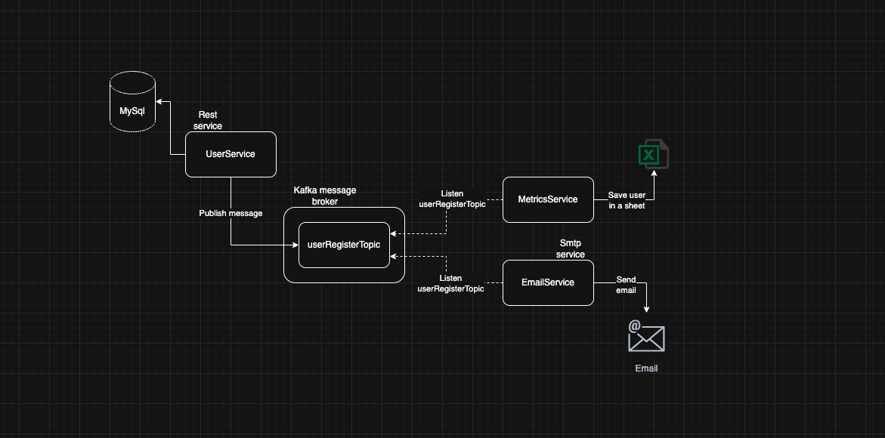

# FSA - Final Project Of Software Architecture

Proyecto modular de microservicios con Spring Boot y Maven que implementa una arquitectura basada en eventos usando Kafka para la comunicación asíncrona entre servicios.

## 📋 Descripción del Proyecto

Este proyecto implementa un sistema de gestión de usuarios con notificaciones automáticas por correo electrónico, utilizando una arquitectura de microservicios orientada a eventos.

### Arquitectura del Sistema



### 🏗️ Servicios

#### 1. **User Service** (Puerto 8081)
Microservicio REST que gestiona el registro y administración de usuarios.
- **Funcionalidades**:
  - Registro de nuevos usuarios
  - Almacenamiento en base de datos MySQL
  - Publicación de eventos de registro en Kafka
- **Tecnologías**: Spring Boot, Spring Data JDBC, MySQL, Kafka Producer
- **API Documentation**: http://localhost:8081/swagger-ui.html

#### 2. **Email Service** (Puerto 8082)
Microservicio que escucha eventos de Kafka y envía correos electrónicos de bienvenida.
- **Funcionalidades**:
  - Consumo de eventos `userRegisterTopic` desde Kafka
  - Envío automático de emails de bienvenida usando SMTP
  - Soporte para Gmail, Outlook y otros proveedores SMTP
- **Tecnologías**: Spring Boot, Spring Cloud Stream, Kafka Consumer, JavaMailSender

#### 3. **Metrics Service** (Puerto 8083)
Microservicio que escucha eventos de Kafka y almacena métricas de registro de usuarios.
- **Funcionalidades**:
  - Consumo de eventos `userRegisterTopic` desde Kafka
  - Generación de métricas y estadísticas de usuarios
  - Almacenamiento en hojas de cálculo (Excel)
- **Tecnologías**: Spring Boot, Spring Cloud Stream, Kafka Consumer, Apache POI

### 🔄 Flujo de Trabajo

1. **Registro de Usuario**: El cliente envía una petición REST al User Service
2. **Persistencia**: El User Service guarda el usuario en MySQL
3. **Publicación de Evento**: Se publica un evento `UserRegisteredEvent` en el topic de Kafka
4. **Procesamiento Asíncrono**: 
   - Email Service consume el evento y envía un correo de bienvenida
   - Metrics Service consume el evento y registra las métricas en Excel
5. **Notificación**: El usuario recibe un email de bienvenida en su bandeja de entrada

### 🛠️ Infraestructura

- **MySQL**: Base de datos relacional para almacenamiento de usuarios
- **Kafka + Zookeeper**: Message broker para comunicación asíncrona entre servicios
- **Schema Registry**: Gestión de esquemas Avro para serialización de eventos
- **Docker Compose**: Orquestación de toda la infraestructura

## 🐳 Inicio Rápido con Docker

### Prerequisitos
- Docker
- Docker Compose
- Java 21
- Maven

### 1. Iniciar Infraestructura
```bash
# Iniciar MySQL y otros servicios
docker-compose up -d

# Verificar que MySQL esté corriendo
docker-compose ps
```

### 2. Ejecutar Microservicio
```bash
# Compilar el proyecto
mvn clean install

# Ejecutar user-service
cd user-service
mvn spring-boot:run
```

### 3. Acceder a Swagger UI
```
http://localhost:8081/swagger-ui.html
```

📖 **Documentación completa de Docker:** [DOCKER.md](DOCKER.md)

---

## Estructura del Proyecto

Este es un proyecto multi-módulo de Maven donde el POM principal (`fsa`) actúa como padre de todos los microservicios.

```
fsa/
├── pom.xml (Parent POM)
├── docker-compose.yml
├── static/
│   └── fsa-archiv1.png
├── user-service/
│   ├── pom.xml
│   └── src/
├── email-service2/
│   ├── pom.xml
│   └── src/
└── metrics-service/
    ├── pom.xml
    └── src/
```

## Configuración Maven

### POM Principal (Parent)
- **GroupId**: `com.funlam`
- **ArtifactId**: `fsa`
- **Version**: `0.0.1-SNAPSHOT`
- **Packaging**: `pom`
- **Parent**: `spring-boot-starter-parent` 3.5.7

### Módulos
Los siguientes microservicios están configurados como módulos del proyecto principal:
1. `user-service` - Servicio REST para gestión de usuarios (Puerto 8081)
2. `email-service2` - Servicio de notificaciones por correo (Puerto 8082)
3. `metrics-service` - Servicio de métricas y reportes (Puerto 8083)

Cada módulo hereda del POM principal (`fsa`) la configuración común:
- Versión de Java: 21
- Spring Boot: 3.5.7
- Plugins y configuraciones de compilación

## Comandos Maven

### Compilar todo el proyecto (desde la raíz)
```bash
mvn clean install
```

### Validar la configuración
```bash
mvn validate
```

### Compilar solo un microservicio específico
```bash
cd user-service
mvn clean install
```

### Ejecutar tests de todos los módulos
```bash
mvn test
```

### Ejecutar un microservicio
```bash
# User Service
cd user-service
mvn spring-boot:run
```

```bash
# Email Service
cd email-service2
mvn spring-boot:run
```

```bash
# Metrics Service
cd metrics-service
mvn spring-boot:run
```

## Ventajas de esta Configuración

1. **Gestión centralizada**: Todas las dependencias y versiones se gestionan desde el POM principal
2. **Construcción en cadena**: Maven compila todos los módulos en orden con el Reactor
3. **Configuración compartida**: Los plugins y propiedades se heredan automáticamente
4. **Versionado unificado**: Todos los módulos comparten la misma versión del proyecto

## Agregar Nuevos Microservicios

Para agregar un nuevo microservicio:

1. Crear el directorio del nuevo servicio
2. Crear su `pom.xml` con el parent apuntando a `fsa`:
```xml
<parent>
    <groupId>com.funlam</groupId>
    <artifactId>fsa</artifactId>
    <version>0.0.1-SNAPSHOT</version>
    <relativePath>../pom.xml</relativePath>
</parent>
```
3. Agregar el módulo al POM principal en la sección `<modules>`:
```xml
<modules>
    <module>user-service</module>
    <module>email-service2</module>
    <module>metrics-service</module>
    <module>nuevo-servicio</module>
</modules>
```

## Tecnologías

- Java 21
- Spring Boot 3.5.7
- Maven
- Spring Boot Starter (Web, Test, Actuator, Data JDBC disponibles)
- Lombok (configurado en el parent)

